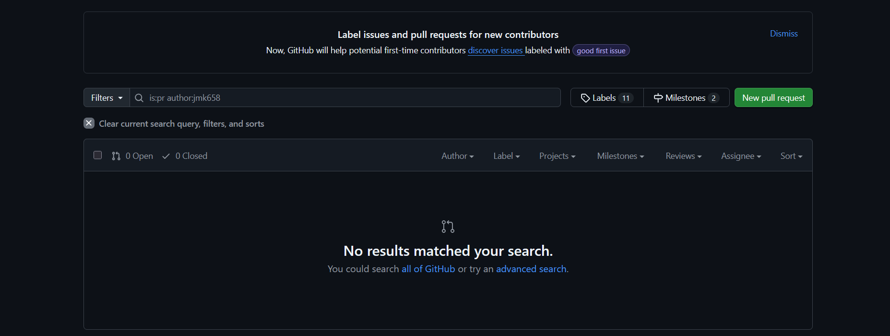
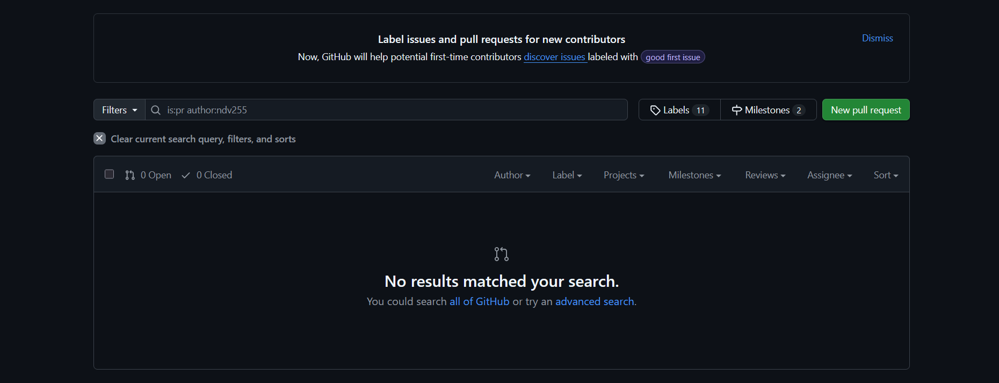
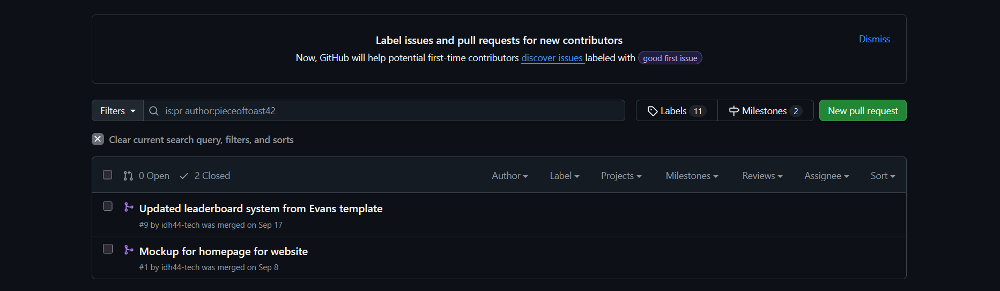
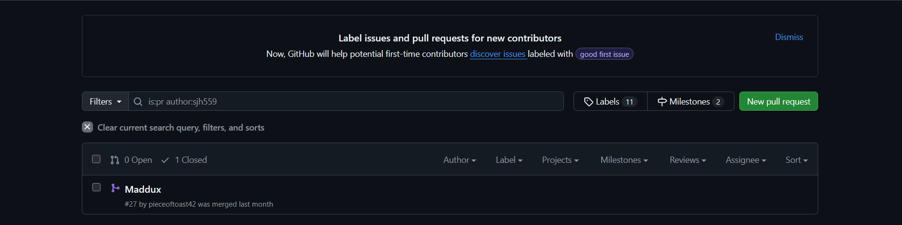
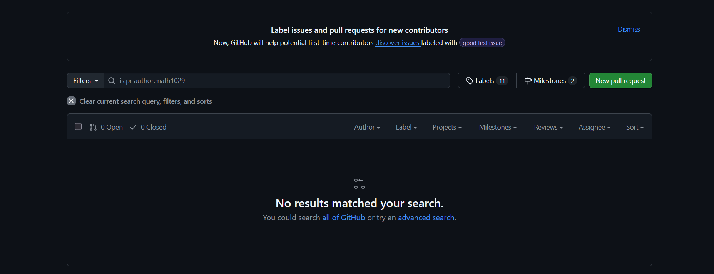
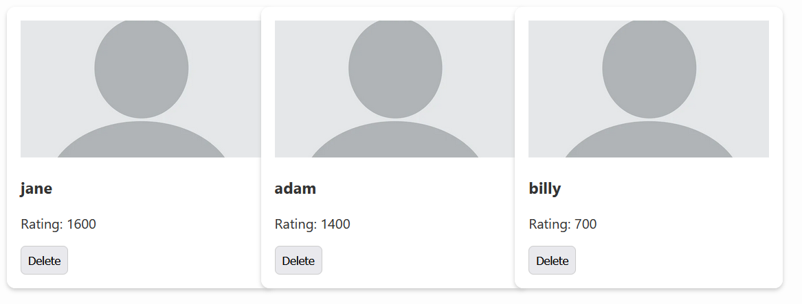

# Introduction

The system is a chess tracker service that exists on a webpage.  It provides useful functions like the ability to create, catalogue, and track profiles of individual players.  It also provides useful rescources such as a page containing information on various openings.  It is mainly targeted towards players who play primarily offline, as it provides many of the services and statistics tracked by online applications.  Our value proposition is that it will allow you to easily and quickly track and manage information about chess players you would otherwise not know or have to write down.  The MVP will implement a feature to create, view, and update player profiles with their elo rating and name.  It will also provide a way to search through these profile and view a leaderboard.  

Repository URL: https://github.com/idh44-tech/Group-3-Chess-Database 

# Implemented Requirements

jmk658:

[link](https://github.com/idh44-tech/Group-3-Chess-Database/pulls?q=is%3Apr+author%3Ajmk658)

2.1:

(Again, doing all the deliverable work and helping coordinate the group, negligible actual development work)

ndv255:

[link](https://github.com/idh44-tech/Group-3-Chess-Database/pulls?q=is%3Apr+author%3Andv255+)

2.2:

Requirement: As a site user I need all the functionality from different parts of the site to function together so nothing in the site breaks.

Issue Link: [here](https://github.com/idh44-tech/Group-3-Chess-Database/issues/31)

Pull Request Link: 

Author: ndv255

Reviewer: 

Automated Testing: 

Visual Evidence: 

pieceoftoast42:

[link](https://github.com/idh44-tech/Group-3-Chess-Database/pulls?q=is%3Apr+author%3Apieceoftoast42)

2.3:

Requirement: As a site user I need to information stored to be in a databse so everyone can see everyone else's profiles.

Issue Link: [here](https://github.com/idh44-tech/Group-3-Chess-Database/issues/30)

Pull Request Link: 

Author: pieceoftoast43

Reviewer: 

Automated Testing: 

Visual Evidence: 

sjh559:

[link](https://github.com/idh44-tech/Group-3-Chess-Database/pulls?q=is%3Apr+author%3Asjh559)

2.4

Requirement: As a site user I want to be able to search through all the players recorded on the site by name.

Issue Link: [here](https://github.com/idh44-tech/Group-3-Chess-Database/issues/28)

Pull Request Link: 

Author: sjh559

Reviewer: 

Automated Testing: 

Visual Evidence: 

math1029:

[link](https://github.com/idh44-tech/Group-3-Chess-Database/pulls?q=is%3Apr+author%3Amath1029)

2.5

Requirement: As a site user I want to be able to see a leaderboard of the top players at any time.

Issue Link: [here](https://github.com/idh44-tech/Group-3-Chess-Database/issues/29)

Pull Request Link: 

Author: math1029

Reviewer: 

Automated Testing: 

Visual Evidence: 

# Automated Testing

# System Demonstration

# AI-Assisted Code Quality Review

# Retrospective Analysis

## Key Learnings

Over the whole project, some of the most important things we've come to understand are the importance of team coordination and communication.  Many of us brought many different backgrounds and skillsets to the project, and learning how to effectively cover each other's weaknesses while leveraging our strengths was key to facilitating development.  

## Challenges Overcome

Some of our greatest struggles were in combining the features we developed separately into one final product.  There were often issues with how different people's code handled things differently that required significant work to get everything functioning smoothly together.  Sometime one person would end up rewriting some else's code just so it could work properly with the rest of the site.

## Future Improvements

In the future, it would be a good idea to implement practices that necessitate the code being more modular and more interoperable.  Defining some kind of standard to make everything that people contributed encapsulated in a nice, modularized component would go a long way towards saving the team headaches in large projects.  
