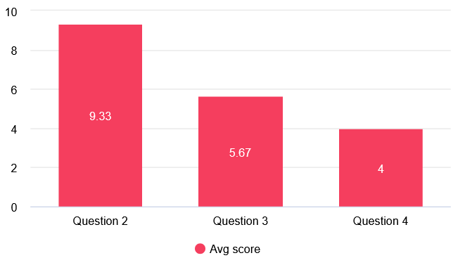

# Description

Our system is a chess player database in the form of a website which allows the user to upload, modify, and remove user profiles with information such as name and elo rating.  The system is targeted towards chess players, mostly those who play offline and wish to track theirs and others statistics for chess.  The system would cut down on time and energy spent remembering or recording player information while also giving accurate, easily available information on the site.  The MVP includes the ability to add, modify, and delete user profiles, as well as search through them and view a leaderboard.  

# User Evaluation Script

Introduction: Explain what the chess tracker is, how it is supposed to work

Tasks:  

1. Have them try to add a profile  
2. Have them try to delete a profile  
3. Have them try to search for a profile that they know exists  
4. Have them try to navigate to the openings page  

Interview questions:  

1. Do you feel any of the tasks were either particularly easy or particularly difficult?  
2. On a scale of 1-10, how easy did you feel it was to complete the tasks in general?  
3. On a scale of 1-10, how useful do you envision this system being?  
4. On a scale of 1-10, how likely would you be to consider using this system yourself?  
5. Is there anything you particularly liked or disliked about using the system?  
6. Is there anything else you would like to add or comment?

# Results Summary

## Interview 1

Interviewer: Jason Kelly

Interviewee: Julia Kelly

Participant relevance to target demographic: Chess player

Question 2 score: 9

Question 3 score: 3

Question 4 score: 1

Common themes: Confused about the purpose of the website

Quotes: "What is the website for?"

Pain points: Was confused on what the "add file" button was for

## Interview 2

Interviewer: Seamus Hamilton

Interviewee: Esteban Grijalva

Participant relevance to target demographic: user and chess player

Question 2 score: 9

Question 3 score: 5

Question 4 score: 2

Common themes: Felt the system was very bare-bones

Quotes: "It seems basic"

Pain points: wanted to press enter to search instead of pushing a button

## Interview 3

Interviewer: Maddux Houseman

Interviewee: Cooper Houseman

Participant relevance to target demographic: Occasional chess player

Question 2 score: 9

Question 3 score: 5

Question 4 score: 4

Common themes: Felt it would be useful for small groups and friends

Quotes: "It would be good for smaller groups"

Pain points: Confused on the purpose of the "add file" button

## Interview 4

Interviewer: Evan Paddock

Interviewee: Carson Johnson

Participant relevance to target demographic: President of the NAU chess club

Question 2 score: 9

Question 3 score: 9

Question 4 score: 9

Common themes: Very positive

Quotes: "It looks very practical."

Pain points:  Had trouble finding the button for the site

## Interview 5

Interviewer: Evan Paddock

Interviewee: Adam Johnson

Participant relevance to target demographic: plays chess both casually and competitively

Question 2 score: 10

Question 3 score: 7

Question 4 score: 5

Common themes: Website is fundamentally solid, just need polish

Quotes: "Add button instead of a link to openings page"

Pain points: thinks the website is underwhelming.

## Interview 6

Interviewer: Noah Valdez

Interviewee: Hannah Guzman

Participant relevance to target demographic: casual chess player

Question 2 score: 10

Question 3 score: 5

Question 4 score: 3

Common themes: Thinks the website's visual design is lackluster

Quotes: "The website's look is somewhat bland."

Pain points: Disliked the visual look of the site.

# Analysis and Reflection

(average scores for each of the quantitiative questions)

# Proposed Improvements

