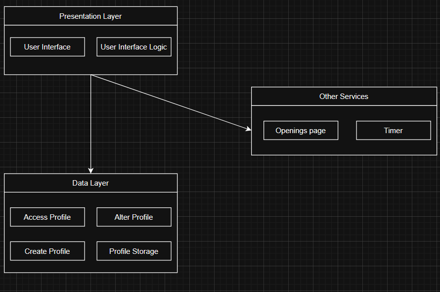
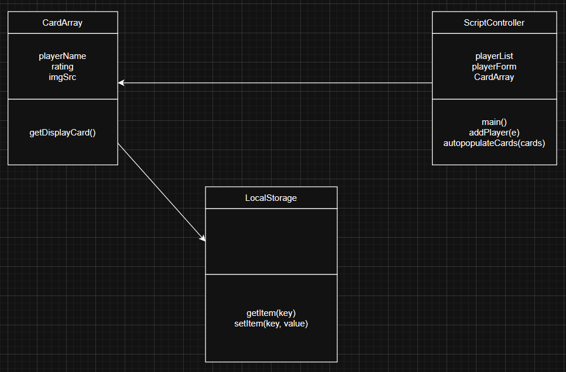

# Description

Our system is a website that allows users to create, update, and view information on chess players.  The site will track values such as elo, winrates, and common openings played.  It will also include useful miscellaneous usefule features such as a page providing information on various chess openings.  The site is targeted primarily towards players who play mostly in-person and don't have access to the information that playing online provides.  

# Architecture

The rationale for the design of our architecture is fairly intuitive.  We have the user interface and the associated logic.  We have the player profiles, and the storage, creation, and modification of them as our "data" layer.  Finally we have another category for other, miscellaneous services included.  

# Class Diagram

# Sequence Diagram

Use case: add a new player

