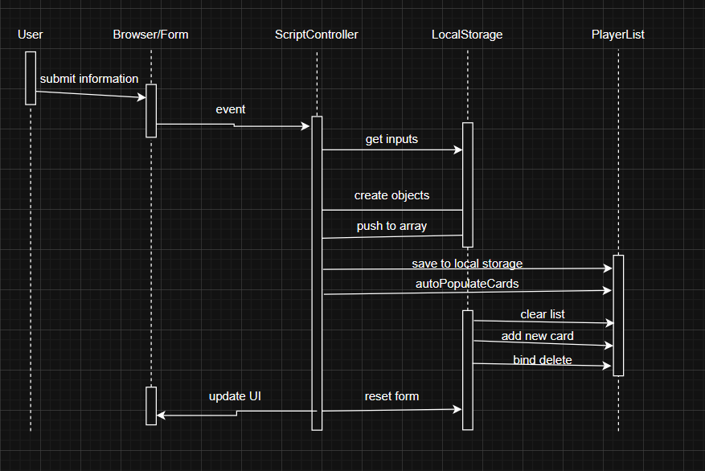

# Description

Our system is a website that allows users to create, update, and view information on chess players.  The site will track values such as elo, winrates, and common openings played.  It will also include useful miscellaneous usefule features such as a page providing information on various chess openings.  The site is targeted primarily towards players who play mostly in-person and don't have access to the information that playing online provides.  

# Architecture

The rationale for the design of our architecture is fairly intuitive.  We have the user interface and the associated logic.  We have the player profiles, and the storage, creation, and modification of them as our "data" layer.  Finally we have another category for other, miscellaneous services included.  

# Class Diagram

# Sequence Diagram

Use case: add a new player

# Design Patterns

Our system doesn't explicity use any classes so far, so I can't show references to specific classes implementation, but the underlying behavior still aligns with some design patterns, so it can be represented as such.  

## Observer Pattern

## Memento Pattern

# Design Principles

Our system implements both the Separation of Concerns (SoC) principle and the Don't Repeat Yourself (DRY) principle.  The SoC principle dictates that every part of the code should separate out a clear and well-defined functionality.  Our code demonstrates this in the HTML file with the following code:

'''
<form id="playerForm">
  <input type="text" id="Player Name" placeholder="Player Name" required />
  <input type="text" id="Rating" placeholder="Rating" required />
  <button type="submit">Add Player</button>
</form>
'''

This code recieves no information about how player information is stored, it just triggers an event and lets the Javascript handle the rest.  The DRY principle is about avoiding repeating code by using loops or functions.  Our code demonstrates this in our JavaScript file with the function autopopulateCards:

'''
function autopopulateCards(cards) {
  playerList.innerHTML = "";
  cards.forEach(card => {
    const div = document.createElement("div");
    div.classList.add("player-card");
    div.innerHTML = `
      
      <h3>${card.playerName}</h3>
      
Rating: ${card.rating}

      <button class="delete-btn">Delete</button>`;
    playerList.appendChild(div);
  });
'''

The code for rendering the cards is only written once and reused wherever necessary.  
