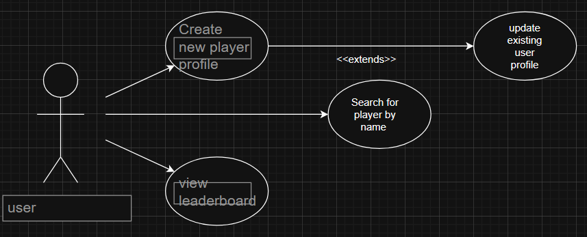
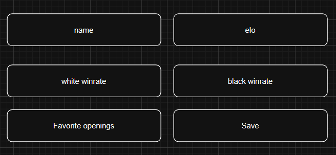
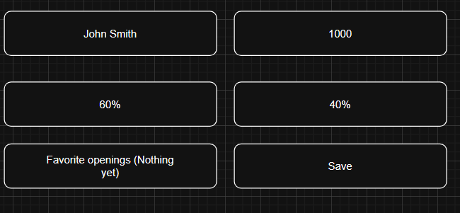
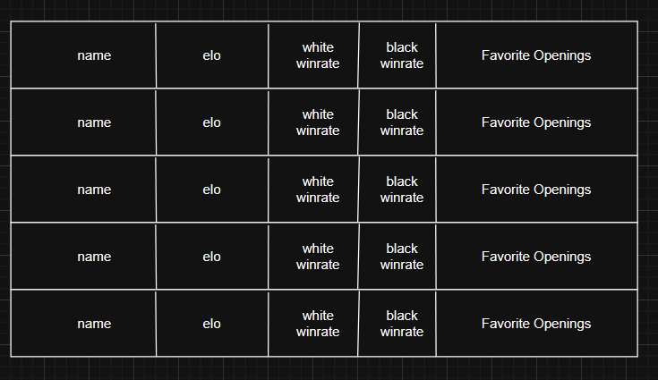
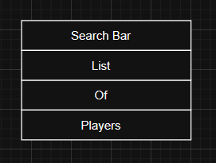

# **Positioning**
## Problem Statement

The problem of not having an easy way to track certain chess statistics and information about players affects chess players, mostly those who often play offline, the impact of which is they find it harder to track the habits and overall performance of themselves and others.

## Product Position Statement

For chess players who wish to track performance metrics the tracking database is a website that lets them upload and view various statistics on themselves and other players.  Unlike simply memorizing or keeping notes, our product allows you to easily track multiple statistics and keep track of them digitally.  

## Value Proposition and Customer Segment

Value Proposition: Our chess tracker app lets players keep track of detailed information on chess players in a quicker and easier manner than simply memorizing or taking your own notes

Customer Segment: Chess players who often play against the same people in person

# **Stakeholders**

Users: Chess Players  
Developers: Our Group  

# **Functional Requirements (features)**

1. Ability to enter and record new player information
2. Statistics that can be updated and track things like elo, winrate, favorite openings, etc.
3. Search feature to quickly find certain players' information
4. Leaderboard showing the best-rated players currently

# **Non-Functional Requirements**

- New information uploaded is displayed within 2 seconds (on refresh)
- When clicking on a particular profile, it is shown within 2 seconds
- The site should work on all major browsers, including chromium-based browsers, firefox-based browsers, and safari

# **MVP**

The mimimum viabel product will:  
-Have that ability for users to upload and update profile information on players  
-Have a search feature that allows users to search for particular players by name  
-Have a leaderboard displaying the highest-rated players currently  

# **Use Cases**
## Use Case Diagram

  

## Use Case Descriptions and Interface Sketch

Title: Create new player profile  
Actors: User  
Preconditions: User is on the site  
Postconditions: New player profile is uploaded  
Success Scenario:  
User: enters player name  
User: enters all necessary player statistics  
User: enters any optional player statistics  
User: finishes and presses button to upload  
System: records player information and ranks them accordingly  
Extenstions:  
2a: User did not enter all required information (name and elo)  
System: generate errror message telling user they must enter at least the name and elo of the player.  
Interface Sketch:  
  

Title: Update existing player profile  
Actors: User  
Preconditions: Player profile exists and user is viewing it  
Postconditions: Player profile is changed new fit new parameters  
Success Scenario:  
user: Selects option to update profile  
system: opens page to update player information  
user: changes or enters whatever new information they want  
user: confirms changes  
system: records new information and overwrites old information  
system: displays new information on player profile  

Extensions:  
2a: user entered improper information(eg, not a number for elo)  
system: generate an error message for all fields with invalid information  
Interface Sketch:  
  

Title: View leaderboard  
Actors: User  
Preconditions: user is on site  
Postconditions: leaderboard is displayed  
Succcess Scenario:  
user: selects option to view leaderboard  
system: displays leaderboard indicating the current highest ranked players and their basic information (name, elo)  
Extensions:  
2a: leaderboard fails to load properly  
system: generate error messgage saying it cannot load the leaderboard  
Interface Sketch:  
  

Title: Search for Player by name  
Actors: User  
Preconditions: user is on site  
Postconditions: players are narrowed down to all whose names include the searched string of characters  
Success Scenario:  
user: enters string of characters that is part of a player's name  
system: displays all players that have that string in their name  
user: clicks on the user they are looking for  
system: displays that user's profile  
Extensions:  
2a: player with searched string in name does not exist  
system: Informs user that no such player exists in the database  
Interface Sketch:  
  

# **User Stories**

1. As a chess player I want to be able to track my own performance so that I can see how I've improved.  Priority: mid. Hours: 2
2. As a chess player I want to track my friends' performance so that I can see how well they're doing.  Priority: high. Hours: 1
3. As a chess player I want to see what other players' most common openings are so that I can know what other people like to play.  Priority: mid. Hours: 3
4. As a chess player I want to create new profiles for other players so that I can track their stats.  Priority: high. Hours: 2
5. As a chess player I want to see a nice list of all the players that are being tracked so that I can see who is on the database.  Priority: low. Hours: 2
6. As a chess player I want to update player profiles so that I can see the player's new stats.  Priority: mid. Hours: 3
7. As a chess player I want to have a nice and intuitive interface so that I can navigate the site more easily.  Priority: low. Hours: 4
8. As a chess player I want to see profiles on the highest performing players so that I know how I measure up.  Priority: low. Hours: 3
9. As a chess player I want to quickly search all the players so that I can find information on someone I'm curious about.  Priority: mid.  Hours: 2
10. As a chess player I want to quickly access the site so that I can quickly pull up the information I want.  Priority: mid.  Hours: 1
